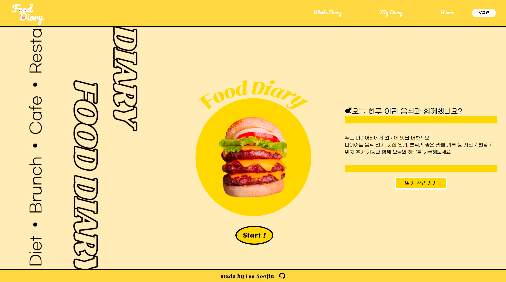
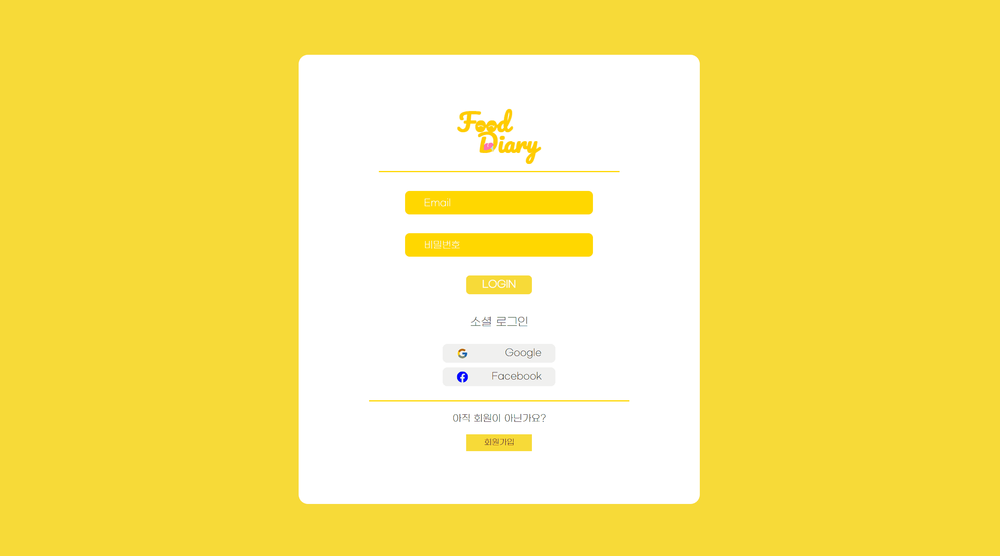
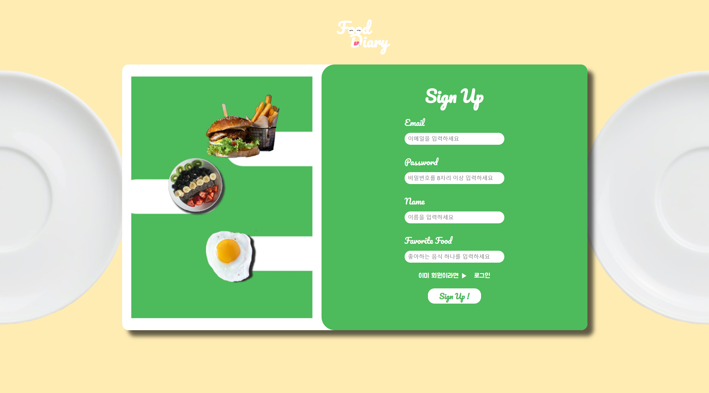
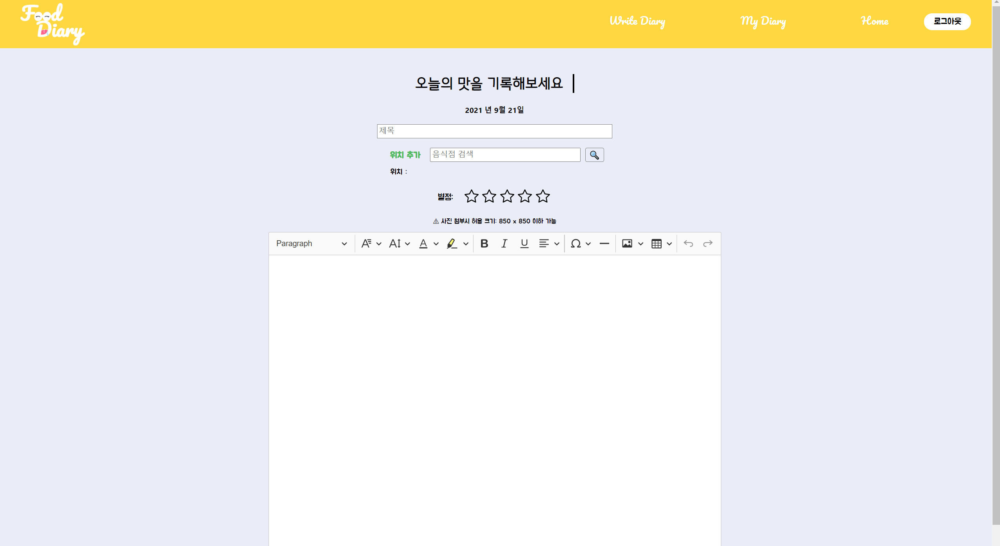
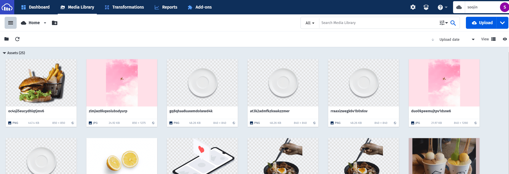
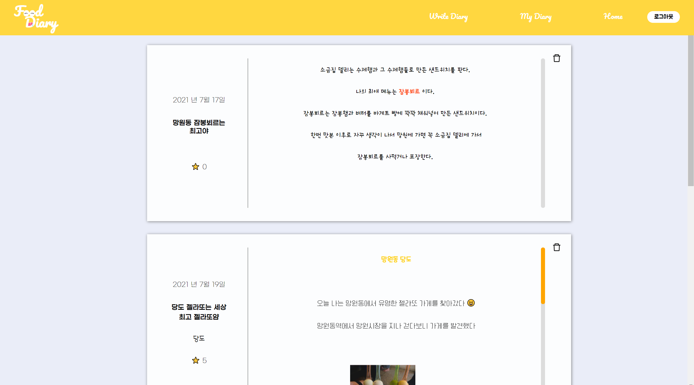
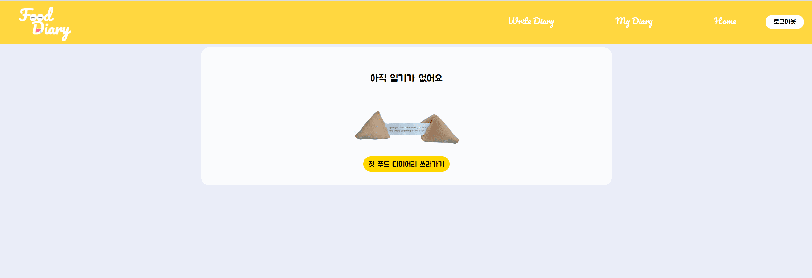
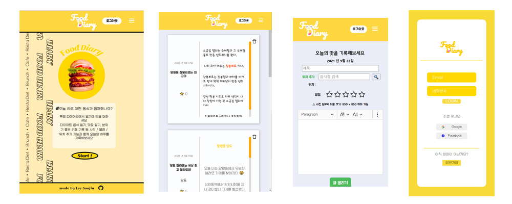
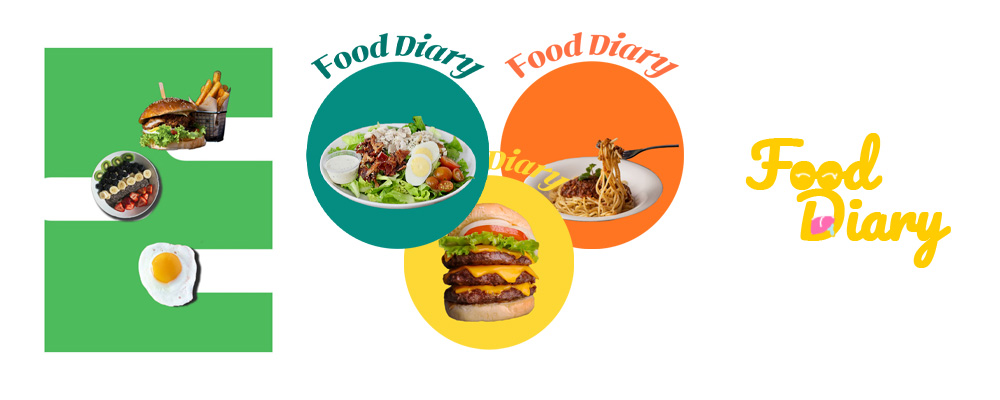

# 푸드 다이어리 Food Diary

배포 주소: <https://6149c2c3a53111b06525d33d--food-diary.netlify.app>

## 제작 동기

예전부터 일기 작성 사이트를 구현하고 싶었다. 하지만 이미 여러 일기 사이트, 어플리케이션들이 존재하고 있기에 차별화된 재미를 부가하고 싶었다.
그리고는 우리 모두의 일상과 밀접한 관계를 가진 것이 무엇이 있을까 생각해보았다. 그러다가 문득 폰의 갤러리에 들어가보았다. 갤러리 속 반 이상을 차지한 음식 사진들이 눈에 띄었다. 그 사진들은 그날 함께한 사람, 공간, 분위기들을 연상하게 해주었다. 많은 음식사진들을 보며 음식으로 표현하는 일기를 쓸 공간이 있다면 재밌겠다는 생각이 들었다.

그리하여 **푸드 다이어리**를 만들게 되었다.

푸드 다이어리를 작성함으로서 다이어터들은 하루의 다이어트 음식을 기록할 수 있고 먹는 것 자체에 진심인 사람들은 하루를 같이한 음식들을 기록하고 맛집을 기록할 수도 있다.

## 기술 스택

          

---

## 디렉토리 구조

—src  
├─components  
│ ├─board  
│ ├─custom_img_upload  
│ ├─diary  
│ ├─header  
│ ├─home  
│ ├─login  
│ ├─post  
│ ├─posts  
│ ├─search  
│ ├─signup  
│ └─star_score  
├─fonts  
├─image  
└─service

---

## 사이트 소개

### Home Page(Start Page)

사이트의 시작페이지이다. 'Start' 버튼이나 '일기 쓰러가기' 버튼을 누르면 로그인창으로 이동한다.
중앙에 세장의 이미지가 시간에 따라 차례대로 나타나는 애니메이션이 동작한다.

### Login Page

이메일 로그인, 구글, 페이스북 계정을 이용한 소셜 로그인이 가능하다.
회원가입을 위한 버튼이 하단에 위치해있다.
**Firebase Authentication**을 이용해 구현했다.

### Sign up Page

이메일을 이용한 간편 회원가입을 할 수 있다. 회원가입 기능도 **Firebase Authentication**을 이용했다.

### Diary Page (다이어리 작성 페이지)

일기 작성용 에디터는 **ckeditor5 api**를 이용해 구현하였다. 여러 종류의 글씨 색상 선택, 폰트 선택 등 기능을 커스터마이징하여 더 다양하게 일기를 꾸밀 수 있도록 했다.
**Naver 장소검색 API**를 이용하여 장소를 검색하여 추가할 수 있다. 또한 오늘의 음식에 대한 별점을 매길 수 있다. 작성된 일기는 Firebase Realtime Database에 저장된다. 일기에 추가된 이미지들은 *Cloudinary*에 저장이 되어지고 자동으로 크기 조절이 되어 일기장에 저장되어진다.

_Cloudinary 저장_

### Board Page (일기 저장 페이지)

작성한 일기가 나열된 저장공간이다. Firebase Realtime Database 를 통해 일기가 저장되고 불러와진다. 일기 위의 오른쪽 상단 삭제버튼을 이용해 일기를 삭제할 수도 있다.

_일기가 없는 경우 Board page_

## CSS

### 반응형

창의 크기에 따라 요소들의 정렬 및 크기 등이 조정된다.

### 사진들

로고, 배경, 홈 이미지 등 여러 이미지들은 Photoshop을 이용해 제작했다.

