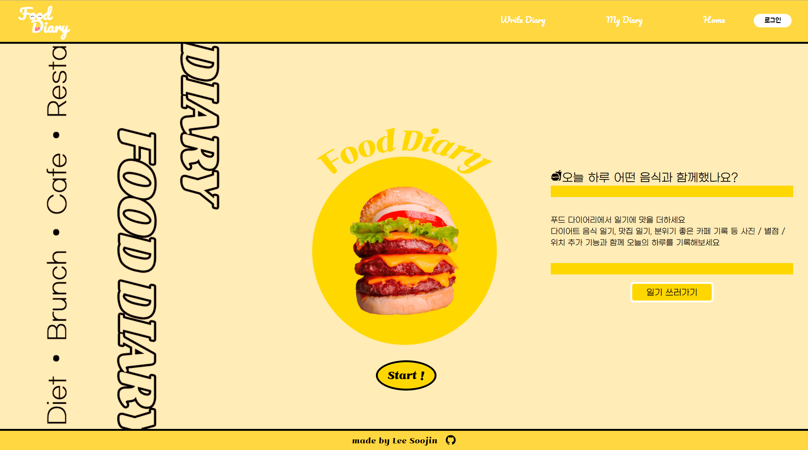
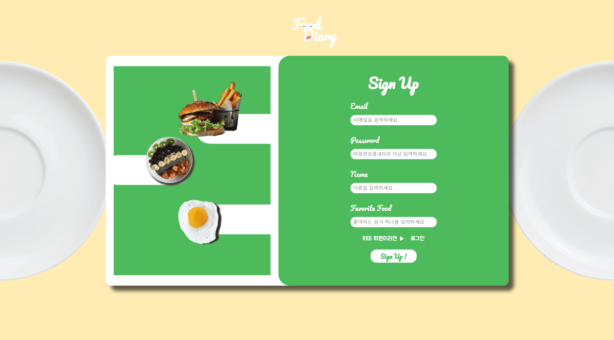
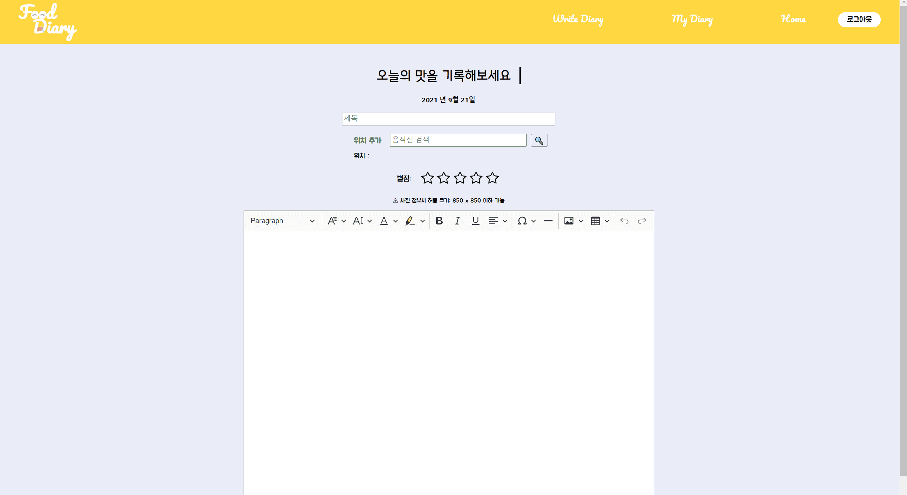

# 푸드 다이어리 Food Diary

배포 주소: <https://6149c2c3a53111b06525d33d--food-diary.netlify.app>

## 기술 스택

 
      
 
  

---

## 디렉토리 구조

---

## 사이트 소개

### Home Page(Start Page)

사이트의 시작페이지이다. 'Start' 버튼이나 '일기 쓰러가기' 버튼을 누르면 로그인창으로 이동한다.
중앙에 세장의 이미지가 시간에 따라 차례대로 나타나는 애니메이션이 동작한다.

### Login Page

이메일 로그인, 구글, 페이스북 계정을 이용한 소셜 로그인이 가능하다.
회원가입을 위한 버튼이 하단에 위치해있다.

### Sign up Page

이메일을 이용한 간편 회원가입을 할 수 있다. 로그인과 회원가입 기능은 **Firebase Authentication**을 이용했다.

### Diary Page (다이어리 작성 페이지)

일기 작성용 에디터는 ckeditor5 api를 이용해 구현하였다. 여러 종류의 글씨 색상 선택, 폰트 선택 등 기능을 커스터마이징하여 더 다양하게 일기를 꾸밀 수 있도록 했다.
Naver 장소검색 api를 이용하여 장소를 검색하여 추가할 수 있다. 또한 오늘의 음식에 대한 별점을 매길 수 있다.

### Board Page (일기 저장 페이지)

작성한 일기가 나열된 저장공간이다. Firebase Realtime Database 를 통해 일기가 저장되고 불러와진다. 일기 위의 오른쪽 상단 삭제버튼을 이용해 일기를 삭제할 수도 있다.

_일기가 없는 경우 Board page_

